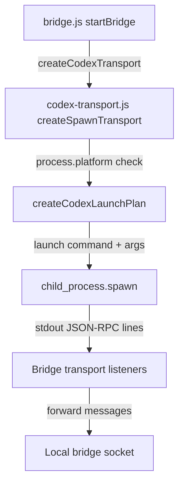
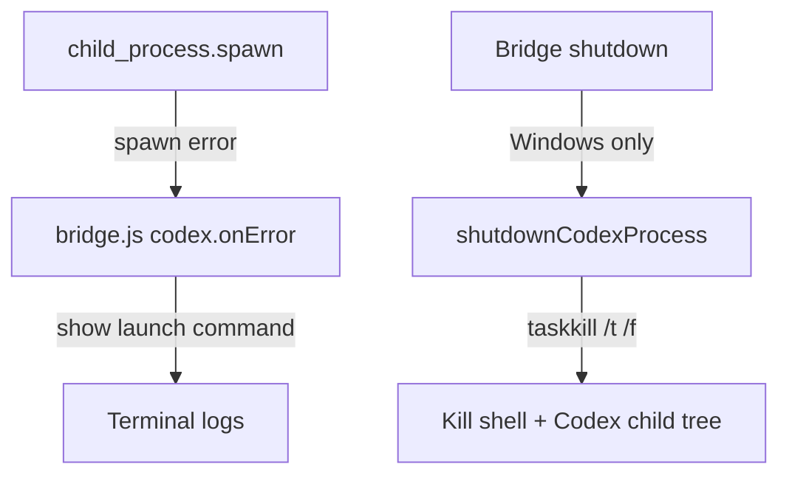

# Recap: Windows Codex Launch Fix
> Generated: 2026-03-10  |  Scope: 3 files

---

## Summary

This task fixed a Windows startup bug in the local bridge. The bridge used to spawn `codex app-server` directly on every platform, which breaks on Windows when the CLI is exposed through the usual `.cmd` launcher. The bridge now uses one platform-aware launch path, kills the full Windows process tree on shutdown, and prints a more useful startup error message.

---

## Files Affected

| File | Status | Role |
|---|---|---|
| `phodex-bridge/src/codex-transport.js` | ✏️ Modified | Added platform-aware spawn planning and safe Windows shutdown |
| `phodex-bridge/src/bridge.js` | ✏️ Modified | Improved startup error logging to show the actual launch command |
| `Docs/RECAP-windows-codex-launch.md` | ✅ Created | Recap for the Windows launcher fix |

---

## Logic Explanation

### Problem
Windows users could have Codex installed and working in their terminal, but `remodex up` still failed with `spawn codex ENOENT`. The bridge assumed the same direct child-process launch worked everywhere, which is not true for the Windows `.cmd` launcher path.

### Approach
The fix keeps launch selection in one helper so the bridge chooses exactly one command based on `process.platform`. This is safer than trying several commands in sequence, because retries could create duplicate child processes and make shutdown messy.

### Step-by-step
1. `createCodexLaunchPlan()` now builds the spawn command once. On macOS/Linux it still launches `codex app-server` directly, while on Windows it launches `cmd.exe /d /c codex app-server` so the `.cmd` shim resolves correctly.
2. `createSpawnTransport()` uses that launch plan for both the actual spawn call and the human-readable description shown in errors. This keeps behavior and logging aligned.
3. `shutdownCodexProcess()` now uses `taskkill /pid <pid> /t /f` on Windows. That kills the shell wrapper and its child process tree together, which avoids orphaning `codex app-server`.
4. `bridge.js` now logs the exact launch command when startup fails. That makes Windows debugging much clearer than the old PATH-only message.

### Tradeoffs & Edge Cases
Using `cmd.exe` on Windows adds a shell wrapper, so shutdown must be tree-aware. The new `taskkill` path handles that tradeoff. I could not run a real Windows process in this macOS workspace, so verification was done with syntax checks and a mocked spawn test that confirmed command selection and shutdown commands.

---

## Flow Diagram

### Happy Path

### Error Path

---

## High School Explanation

Imagine Remodex is trying to open a game by double-clicking the launcher. On Mac and Linux, it can open the game app directly. On Windows, though, the thing called `codex` is often more like a shortcut file, so trying to open it the same way can fail even when the game is installed.

The fix teaches Remodex to use the right door for each computer. On Windows it now says, basically, "hey Command Prompt, please start Codex for me," which is the normal way that shortcut works. Then, when Remodex shuts down, it does not just close the front window and leave the game running in the background. It closes the whole stack cleanly.
